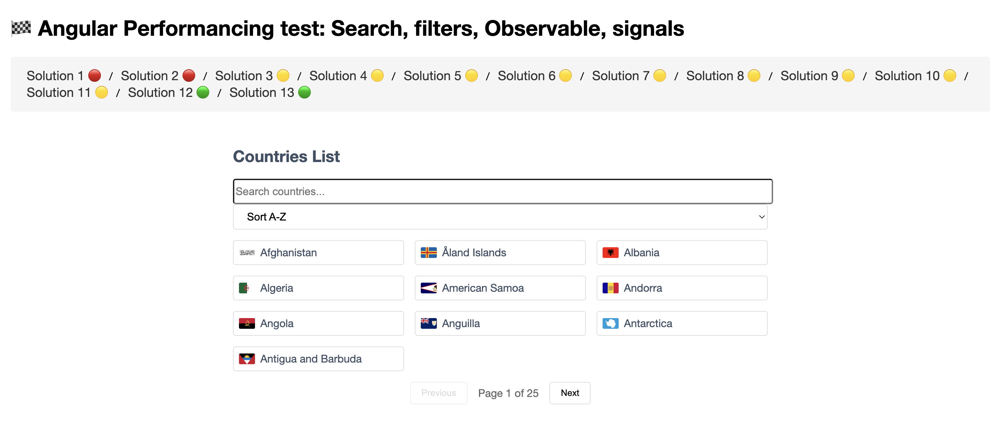

# Angular (19+) Signal Power: Angular Forms, Search & Filter Performance Lab

- This project serves as a comprehensive demonstration of Angular's flexibility in implementing the same core functionality through different patterns and approaches, each with its own trade-offs in terms of complexity, maintainability, and performance.


---

## Demo



---

## Evaluation Criteria

- Modern Angular best practices (Signals, Standalone Components, RxJS, etc.)
- Performance (reactivity, change detection, memory)
- Maintainability (readability, modularity, testability)
- Scalability (how well it would work in a larger app)
- Follows new modern Angular trends

---

## Resoltion Solution evaluations

### Solutions 1–5: Classic RxJS & Forms Approaches
| Solution | Approach | Rating | Notes |
|----------|----------|--------|-------|
| 1 | Template-driven forms, RxJS, filter pipe, manual subscription mgmt | 1 | Outdated, verbose, not idiomatic for modern Angular. |
| 2 | Template ref variable, RxJS, filter pipe | 1 | Slightly better, but still not scalable or modern. |
| 3 | Reactive Forms, RxJS, filter pipe | 2 | More modern, but relies on pipes and manual RxJS. |
| 4 | Material input, Reactive Forms, RxJS, filter pipe | 2 | Good for Material projects, but not leveraging Signals. |
| 5 | Reactive Forms, RxJS, filter pipe | 2 | Clean, but not as modern as Signals-based solutions. |


### Solutions 6–9: Hybrid RxJS + Signals
| Solution | Approach | Rating | Notes |
|----------|----------|--------|-------|
| 6 | Reactive Forms, RxJS, toSignal, filter pipe | 2 | Starts using Signals, but still hybrid and not full Signals. |
| 7 | Like 6, but optimizes for stable values | 2 | Slightly better, but still hybrid. |
| 8 | Template-driven, Signals, RxJS, filter pipe | 2 | Uses Signals, but not fully idiomatic. |
| 9 | Template-driven, Signals, RxJS, filter pipe | 2 | Similar to 8, not fully leveraging Signals' power. |


### Solutions 10–11: Component-Driven, RxJS, and Modular
| Solution | Approach | Rating | Notes |
|----------|----------|--------|-------|
| 10 | Reactive Forms, RxJS, combineLatest, modular | 2 | Good modularity, but not using Signals. |
| 11 | Component-driven (filter, sort, pagination), RxJS, modular | 2 | Very modular, but not using Signals. Good for classic Angular. |


### Solutions 12–13: Full Signals, Modern trendy Angular
| Solution | Approach | Rating | Notes |
|----------|----------|--------|-------|
| 12 | Component-driven, full Signals (computed, effect, toSignal), modular | 3 | Modern, scalable, maintainable, highly recommended. |
| 13 | Full Signals (signal, computed, effect), modular, idiomatic | 3 | Most recommended: idiomatic, performant, future-proof, best for new Angular projects. |

---

## Overall Project Goals

- Demonstrate different approaches to implement the same search functionality in Angular
- Compare various Angular patterns and best practices
- Show evolution from simple to complex implementations
- Warning Spoil: Solution13 is the recommendation!

## Form Handling Approaches
- Template-driven forms (Solutions 1, 8, 9)
- Reactive forms (Solutions 3, 4, 10)
- Manual event handling (Solution 2)
- Component-driven forms (Solution 11)

## Simple State:
- Two-way binding (Solution 1)
- Template reference variables (Solution 2)
- FormControl direct binding (Solution 3)

## Advanced State:
- Signals (Solutions 6, 7, 8, 9, 13)
- RxJS Streams (Solutions 10, 11)

## Pure Signal Solution: Component + Service (httpResource instead httpClient):
- Fully signal-based (Solution 13)
- This is using Angular 19.2+ new "httpResource()" API which is designed to work with signals and provides automatic state management for HTTP requests.
- The `httpResource` provides built-in signals:
+ value for the data
+ isLoading for loading state
+ error for error state
- Main features:
+ Automatic Reactivity
+ Default state
+ Data validation and transformation

## Extra Aditional API notes:
- Filtering: The end-point is already filtering depending on the user-input, but including the filter pipe in our template (countries$ | async | filter:searchFilter), Angular will apply the FilterPipe's transform method to the countries$ observable's emitted values. This means, that each time the countries$ observable emits a new array of countries, Angular will filter those (can be multiple) countries based on the searchFilter string using the logic defined in the FilterPipe. To test: input `UK` it should return only `Ukraine` then check for the console. You must see: `Filter pipe triggered:  true` once 

---

## Conclusion

- `Solutions 1–5` are not recommended for new projects.
- `Solutions 6–11` are transitional or modular, but not as modern as full Signals-based approaches.
- `Solution 13` is the most recommended, followed closely by `Solution 12`. Both use Angular Signals throughout, are modular, and align with the latest Angular best practices and trends for 2024 and beyond.

> If you want the best performance, maintainability, and future-proofing, use Solution 13.

---

## INdividual solutions explanation

1) ✅ Uses:
- Template-driven forms with [(ngModel)] 2-way binding with ngModelChange
- Custom pipe filtering with filter pipe
- RxJS with takeUntilDestroyed pattern
- Reactive search with debounceTime and distinctUntilChanged

2) ✅ Uses:
- Template reference variables (#searchBox)
- Event binding with (input)
- Custom pipe filtering with filter pipe
- RxJS with takeUntilDestroyed pattern
- Reactive search with debounceTime and distinctUntilChanged
- Manual state management for search text

3) ✅ Uses:
- Reactive forms with FormControl and FormGroup
- Direct FormControl binding with [formControl]
- Custom pipe filtering
- RxJS with startWith and takeUntilDestroyed
- valueChanges observableformControl (directly binding the FormControl instance)

4) ✅ Uses:
- Material UI components
- Reactive forms with formControlName
- Custom pipe filtering with slice
- RxJS subscription management
- Typed form controls with interfaces formControlName (directly bind to specific - - input element within the template) 
- .get()

5) ✅ Uses:
- pipe Ng2SearchPipeModule for filtering
- Reactive forms with formControlName
- RxJS with takeUntilDestroyed
- Null safety with optional chaining
- RxJS error handling with map

6) ✅ Uses:
- Angular Signals with toSignal
- Reactive forms with FormGroup
- Effects for signal monitoring
- Custom pipe filtering
- RxJS with startWith and takeUntilDestroyed

7) ✅ Uses:
- Signals with toSignal (based on stable values & optimise for efficient rendering) 
- Reactive forms with FormGroup and formControlName
- Custom pipe filtering
- RxJS with debounceTime and takeUntilDestroyed
- Optimized for efficient rendering

8) ✅ Uses:
- Template-driven forms with [(ngModel)]
- Signals with signal, computed, and effect
- ViewChild for form access
- Custom pipe filtering
- Manual `onSearch` trigger with button

9) ✅ Uses:
- Template-driven forms with [(ngModel)]
- Signals with signal
- Simplified state management
- Custom pipe filtering
- Manual search trigger with button
- DestroyRef for cleanup

10) ✅ Uses:
- Reactive forms with validation
- FormBuilder service
- RxJS combineLatest for data streams
- Mock data with static countries
- Form validation error messages
- RxJS operators (startWith, distinctUntilChanged)
(based on https://github.com/leolanese/Angular-rxjs-filtering-list)

11) ✅ Uses:
- Component-driven architecture
- Separate components for Filter, Sort, List, and Pagination
- Advanced RxJS stream management
- FormBuilder with reactive forms
- Comprehensive data handling (filter, sort, paginate)
- SearchService integration
- Smart and presentational component pattern

12) ✅ Uses:
- Moving to pure signal
- Signal-based form value tracking
- Signal-based state management
- signal() for writable state, computed() Computed values for filtering, sorting, and pagination, effect() for side effects, toSignal() for converting RxJS
- Automatic dependency tracking between signals
- Performance optimization through Signal-based reactivity
- Reactive forms with FormGroup and FormControl (avoiding continuous re-evaluations caused by traditional getters)
- Component composition (reusing Solution11's child components)

> This represents a modern Angular implementation using Signals instead of RxJS Observables for state management, while maintaining the component-driven architecture from Solution 11.

13) ✅ Uses:
### Signal State Management
- Uses a single state signal to manage all application state

### Signal Data Flow
- Manages all state through signals
- Uses computed signals for derived data
- Handles data transformation (filtering, sorting, pagination)
- Communicates with the service layer

## Signal Child Components communication
- SignalFilterComponent: Two-way binding with model() for filter text
- SignalSortComponent: Two-way binding with model() for sort direction
- SignalListComponent: Signal-based input for countries list
- SignalPaginationComponent: Two-way binding with model() for current page

## Signal Service Layer communication
SignalCountryService uses signals for: Data fetching, Loading states, Error handling

> Solution13 represents a modern, fully signal-based Angular application with: Clean architecture, Efficient state management, Type-safe components, Reactive data flow, Optimised performance, Clear separation of concerns, which is more efficient than traditional change detection and provides better developer experience.


## Further explanation `Solution13 as fully signal-based`

### Singal state management
```js
// Base signals for state
filterText = signal('');
sortDirection = signal<'asc' | 'desc'>('asc');
currentPage = signal(0);
```

### Computed Signals for derived state:
```js
filteredCountries = computed(() => {
  const countries = this.countryService.getCountries().data();
  const filter = this.filterText().toLowerCase();
  // ... filtering logic
});

sortedCountries = computed(() => {
  const countries = this.filteredCountries();
  // ... sorting logic
});

totalCount = computed(() => this.sortedCountries().length);
totalPages = computed(() => Math.ceil(this.totalCount() / this.itemsPerPage));
```

### Effects for side effects

```js
effect(() => {
  // Reset page when filter or sort changes
  this.currentPage.set(0);
}, { allowSignalWrites: true });
```

### Signal-based Service

```js
export class SignalCountryService {
  private countries = signal<Country[]>([]);
  private isLoading = signal(false);
  private error = signal<string | null>(null);
  // ...
}
```

### Signal-based Components

```js
// In SignalFilterComponent
filterValue = model.required<string>();

// In SignalListComponent
countries = input.required<Country[]>();
```

---

## Final Soltution13 explanation

1. Data Fetching with Signals
- Service: SignalCountryService uses Angular’s new httpResource API to fetch country data from the REST Countries API.
- Signals: The service exposes the data, loading, and error states as signals via the getCountries() method.
- Automatic Fetch: The HTTP request is made automatically when the resource is created; no manual fetch is needed.

2. Child Components:
- SignalFilterComponent:
Uses model.required<string>() for two-way binding of the filter text signal.
Emits changes to the parent.
- SignalSortComponent:
Uses model.required<'asc' | 'desc'>() for two-way binding of sort direction.
Emits changes to the parent.
- SignalPaginationComponent:
Uses model.required<number>() for two-way binding of the current page.
Receives total pages as an input signal.
- SignalListComponent:
Receives the visible countries as a signal input and displays them.


---

This project was generated with [Angular CLI](https://github.com/angular/angular-cli) version 17+

```js
ng new Angular-Search-Filtering

npm i
npm i bootstrap
```

```js
// package.json
"styles": [
      "node_modules/bootstrap/dist/css/bootstrap.min.css",
      "src/styles.scss"
]
```

```js
ng g s services/country
// later on exploring the Entity Pattern

ng g p pipes/filter
// reusable pipe to filter array based on search term
```

## API Service

We are using "https://restcountries.com" sometimes these services are not as fast as expected, I'm looking forward to replace (maybe with: https://countries.petethompson.net) it but for now it's good enough.

---

## Development server

Run `ng serve` for a dev server. Navigate to `http://localhost:4200/`. The application will automatically reload if you change any of the source files.

## Code scaffolding

Run `ng generate component component-name` to generate a new component. You can also use `ng generate directive|pipe|service|class|guard|interface|enum|module`.

## Build

Run `ng build` to build the project. The build artifacts will be stored in the `dist/` directory.

## Running unit tests

Run `ng test` to execute the unit tests via [Karma](https://karma-runner.github.io).

## Running end-to-end tests

Run `ng e2e` to execute the end-to-end tests via a platform of your choice. To use this command, you need to first add a package that implements end-to-end testing capabilities.

## Further help

To get more help on the Angular CLI use `ng help` or go check out the [Angular CLI Overview and Command Reference](https://angular.io/cli) page.

---
---
### :100: <i>Thanks!</i>
#### Now, don't be an stranger. Let's stay in touch ‼

<a href="https://github.com/leolanese" target="_blank" rel="noopener noreferrer">
  
</a>

##### :radio_button: gitroll: <a href="https://gitroll.io/profile/uCOZ9SM8b7ne9h17NuPuKVky9uFh2" target="_blank">LeoLanese</a>
##### :radio_button: Linkedin: <a href="https://www.linkedin.com/in/leolanese/" target="_blank">LeoLanese</a>
##### :radio_button: Twitter: <a href="https://twitter.com/LeoLanese" target="_blank">@LeoLanese</a>
##### :radio_button: Blog: <a href="https://www.dev.to/leolanese" target="_blank">Blog/a>
##### :radio_button: Questions / Suggestions / Recommendations: <a href="mailto:developer@leolanese.com">developer@leolanese.com</a>
